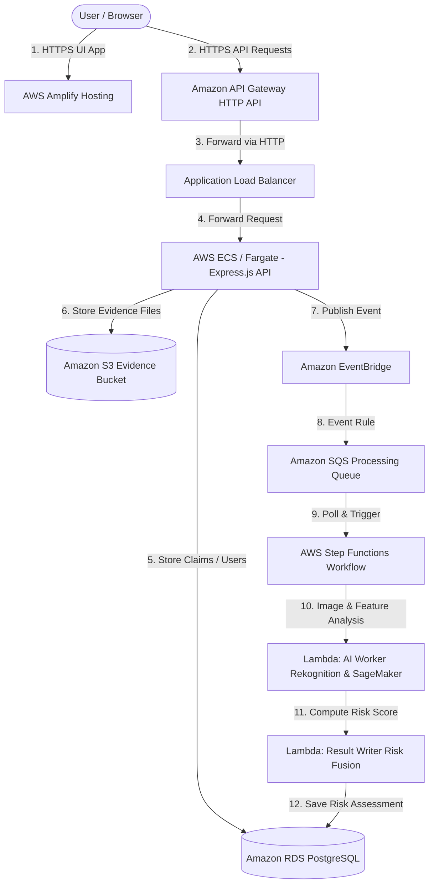

# ClaimGuard AI — Automated Insurance Claim & Fraud Detection Platform

ClaimGuard AI is an event-driven, cloud-native insurance claim processing platform powered by AWS serverless architecture, Computer Vision, and Machine Learning risk fusion models.

---

## 🏗️ Architecture Overview

The system uses a decoupled event-driven microservices architecture to ensure fast user response times while delegating heavy AI/ML calculations asynchronously.



### End-to-End Workflow

1. **Frontend Access**: The user accesses the React Single Page Application (SPA) hosted on **AWS Amplify**.
2. **API Communication**: HTTP API requests from the frontend pass through **AWS API Gateway** (HTTPS endpoint) which proxies to an **Application Load Balancer (ALB)** and onto the **Node.js/Express backend** running on **AWS ECS Fargate**.
3. **Claim & Evidence Upload**:
   - Claim details and metadata are stored in **Amazon RDS (PostgreSQL)**.
   - Uploaded photos/evidence are stored securely in **Amazon S3**.
4. **Asynchronous AI Processing**:
   - Upon evidence upload, the backend emits a `ClaimSubmitted` event to **Amazon EventBridge**.
   - EventBridge routes the event to an **Amazon SQS Queue** (`claimguard-ai-processing`).
   - SQS triggers **AWS Step Functions** (`ClaimGuardAIWorkflow`).
5. **Risk Fusion & Scoring**:
   - **Amazon Rekognition** scans evidence photos for visual damage indicators.
   - **Amazon SageMaker** computes fraud probabilities from claim metadata (claim amount, policy age, past claims, etc.).
   - **AWS Lambda** (`claimguard-result-writer-dev`) performs risk fusion by combining computer vision and ML model probabilities, updating the risk level (`LOW`, `MEDIUM`, `HIGH`) and detailed risk factors in **Amazon RDS**.

---

## 🛠️ AWS Services & Rationale

| Service | Component Role | Rationale |
| :--- | :--- | :--- |
| **AWS Amplify** | Single Page Application (SPA) Hosting | Delivers fast global CDN distribution, free SSL/TLS handling, auto-builds, and SPA routing support. |
| **Amazon API Gateway** | Managed HTTPS API Gateway Endpoint | Acts as an HTTPS proxy to bridge the secure Amplify frontend with the HTTP ECS ALB endpoint, resolving Mixed Content CORS errors. |
| **Application Load Balancer (ALB)** | Load Balancer | Distributes traffic to ECS containers with continuous health checks. |
| **AWS ECS on Fargate** | Express.js API Service Container | Provides serverless compute for Dockerized backend microservices without managing EC2 infrastructure. |
| **Amazon RDS (PostgreSQL)** | Relational Database | Maintains relational integrity for Users, Policies, Claims, Evidence, and Risk Assessments with strong transaction guarantees. |
| **Amazon S3** | Object Storage | Highly available and scalable storage for raw evidence files, accessible via secure pre-signed URLs. |
| **Amazon EventBridge** | Event Bus (`default`) | Decouples synchronous backend user actions from asynchronous AI processing. |
| **Amazon SQS** | Message Queue (`claimguard-ai-processing`) | Buffers incoming events between EventBridge and Step Functions to ensure zero data loss during high load. |
| **AWS Step Functions** | State Machine (`ClaimGuardAIWorkflow`) | Coordinates complex multi-step AI orchestration (Image Analysis → ML Risk Prediction → DB Write → Notification). |
| **AWS Lambda** | Serverless Micro-Functions | Runs lightweight event processing and risk calculation logic on-demand. |
| **Amazon Rekognition & SageMaker** | Computer Vision & ML Modeling | Rekognition detects physical damage in uploaded photos; SageMaker predicts claim fraud probability. |

---

## 🚀 Environment Setup & Deployment

### Backend Setup (`/backend`)
```bash
# Install dependencies
npm install

# Run database migrations
npx prisma migrate dev

# Start local dev server
npm run dev
```

### Frontend Setup (`/frontend`)
```bash
# Install dependencies
npm install

# Build for production
npm run build
```

---

## ⚙️ Configuration & Key Environment Variables

### Backend (`backend/.env`)
- `PORT`: Server execution port (default `5000`)
- `DATABASE_URL`: PostgreSQL connection string (Amazon RDS)
- `AWS_REGION`: Target region (e.g. `us-east-1`)
- `S3_BUCKET_NAME`: S3 Evidence bucket name

### Result Writer Lambda (`lambda-result-writer`)
- `DATABASE_URL`: Amazon RDS PostgreSQL connection URI
- `MODEL_WEIGHT`: Weight assigned to SageMaker ML probability (e.g., `0.6`)
- `REKOGNITION_WEIGHT`: Weight assigned to Rekognition damage signals (e.g., `0.4`)
- `RISK_THRESHOLDS_JSON`: JSON specifying risk tier cutoffs `{"lowMaximum": 0.3, "mediumMaximum": 0.7}`
- `REKOGNITION_LABEL_WEIGHTS_JSON`: Map of image label severity weights `{"Car Front - Damaged": 1.0, "Scratch": 0.5, "Totaled": 1.0}`
